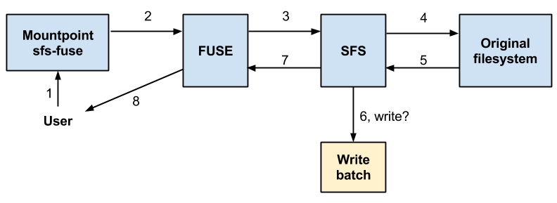
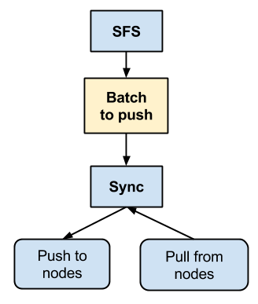
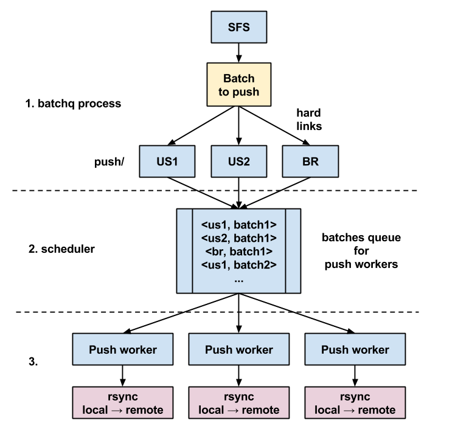
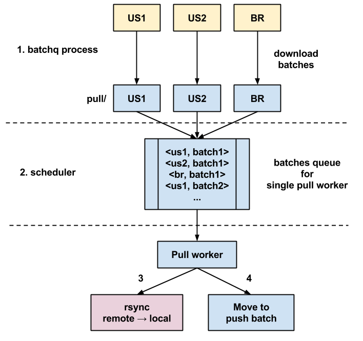

SFS-FUSE implementation details
=====================

The FUSE component is conceptually very simple. It uses the FUSE layer to manage a mountpoint which serves as a proxy for the user requests to the underlying original filesystem.

It doesn't do anything besides managing batches in the temporary directory, and renaming them once they are complete. Completed batches are unmanaged by SFS.

Startup
-------------

SFS is responsible for managing pending batches in the temporary directory. When the process is stopped, it may leave temporary batches around. In order to account this problem, at startup SFS will mark those temporary batches as they were completed.

This approach is simpler and safer than handling temporary batches during the shutdown of the process.

Normal operation
-------------

Each open, read, write, close and other filesystem operations are intercepted by SFS and replayed on the underlying filesystem.

SFS tracks files opened for write. Once the file is closed, the filename is saved in the current batch.

Classic flow example:

1. The user issues a open, then write and finally close a file on the FUSE mountpoint
2. The kernel receives the request and handoffs the request to FUSE, which is the filesystem for that mountpoint from the kernel view point
3. FUSE does some hard stuff and calls the SFS code
4. SFS will handle the open, write and close transparently as much as possible, and performs the relative file operations on the underlying filesystem.
5. SFS receives the result from the original filesystem.
6. If the file was written and now it's closed, SFS will save the file name to the current batch file. If no current batch file is opened, it will create a new one in the temp directory. After writing the event, if the number of events exceeds the max number of events in the batch, SFS will flush the current batch and reset the counter.
7. SFS returns straight the result from the original filesystem.
8. FUSE gives back the result to the user.

SFS writes an event not only when a file is closed for write, but also for file creation and removal, rename, link and symlink, truncate, mkdir and rmdir, chmod and chown, utime, and xattr changes.

As said, the event is only the file name. The synchronization process takes care on whether the file is no more existing, or which attributes and data to transmit. We choose rsync because it does this well.

File are opened with the O_SYNC flag if requested in the configuration file.

Ignored paths
----------

Not all paths are written to batches. Ignored paths include:

- All paths that begin with `ignore_path_prefix`
- `.sfs.conf` and `.sfs.mounted`
- All paths containing `.fuse_hidden`

Additionally, SFS will not write the same file twice in the same batch.

Batch name
----------

The batch filename format is the following: `timestamp_node_host_pid_subid_type.batch`. Node and host may be the same, but you can imagine a logical node being made up of multiple hosts. In which case, batches may be written to a shared directory on NFS.

The `subid` is an incremental id in case the new batch name conflicts with the older batch.

There are two `type`s of batches: `rec` and `norec`, which stand for *recursive* and *non-recursive* respectively. The `rec` events are basically rename operations. Since a directory can be renamed, all the files can also be moved and as such it's a recursive operation. A `rec` batch will be synchronized with `rsync -r`.

SFS will not mix recursive events and non-recursive events in the same batch, which simplifies the job of the sync daemon.

Reconfiguration
----------

At any time the configuration can be changed at runtime. It suffices to save the `/mnt/fuse/.sfs.conf` file, make sure you save it under the FUSE mountpoint. SFS will recognize that the file config has changed and will reload.

PHP-Sync implementation details
===================

The php-sync daemon is the component that knows the other nodes of the network. It has been written in PHP by the time for obvious reasons at Immobiliare.it, but in principle could be written in any other language.

In the [installation guide](INSTALL.md) php-sync was installed only on the central node of a star network. This is the most tested topology.

Architecture
----------

The relationship between the sync daemon and the local sfs-fuse is the following:

SFS-FUSE writes the batches, the sync daemon periodically reads them and pushes the contents of the files (or delete missing files) to the destination using rsync. Using rsync is the default behavior, but as you can see in the configuration file of php-sync this can be easily changed with more custom commands.

PHP-sync keeps nothing in RAM except temporary work queues. It always re-reads batches from the disk, thus it's safe to stop and restart at any time.

Processes
----------

The daemon spawns multiple processes.

### Batchq process ###

Periodically hardlinks batches from the SFS batch directory to `push` directory of each remote node. A batch file is not unlinked from the SFS batch directory until hardlinks have been successfully made for all the remote nodes.

Also periodically checks for remote batches. By default we also use rsync to fetch batches from remote nodes. These batches are put in the `pull` directory of such node.

Batches dir for a node is scanned every `SCANTIME` seconds. If the synchronization for a node failed, the next scan will be done after `FAILTIME` instead.

### Push process ###

There may be multiple push processes. Each push process receives a job, it is a list of batches to push to a single node. If multiple batches are provided, the process reads each file and concatenates the contents.

To ensure that only a single push process replicates data to a certain node, a semaphore is locked for that node.

If the synchronization of the job was successful, all the batches synchronized for that node in the `push` directory is unlinked. Thus it is safe to kill the php-sync process, as in the worst case the batch will be resynchronized, which in general is not a problem when using rsync.

### Pull process ###

This process works similarly to the push process, except it's a single process to ensure consistency when replicating from remote nodes to the local node. This is another source of limitation to parallelism. It can be improved by inspecting batch files and locking single file paths rather than whole nodes.

### Sched process ###

The scheduler repeatedly scan `push` and `pull` directories for new batches. It does not mix push and pull jobs, hence it's a source of limitation to parallelism. This is to ensure that a file sent to a remote node is not overwritten locally by a pull right afterwards, otherwise the same file would require another sync to the remote nodes.

The scheduling is simple, it creates jobs and feeds them to a queue. A job is a pair `<node, batches list>`. Each push process as well as the pull process wait for jobs from this common queue.

If the first batch is older than `BULK_OLDER_THAN` seconds, the scheduler accumulates batches. It stops accumulating once a batch newer than `BULK_OLDER_THAN` seconds is encountered, or `BULK_MAX_BATCHES` is hit. In this case, the job is filled with multiple batches (a bulk) instead of a single batch file.

Push flow
----------

Replication from the local node starts from the SFS fuse component registering batches, and the sync daemon reading them. The php-sync batchq process will hardlink the batch to the push directory of each node. Then the scheduler reads the list of batches from those push directories and creates the jobs. Each push worker will read a job from the queue and do the synchronization with rsync.

Pull flow
----------

Replication from the remote node starts from the remote SFS fuse component writing batches. The php-sync batchq process will fetch batches from the remote directory to local pull directory for each node. The scheduler then reads the list of batches from those pull directories and creates the jobs. The pull worker pops a number of jobs from the queue and synchronizes the data.

Each successful batch is then moved to all other remote nodes for push, except the receiving node.

Example pull/push flow
----------

A more complete example is shown below. A remote node writes a file, then SFS creates a batch. This batch will be fetched by the central node. Then the same central node will fetch files according to the file list in the batch. That same batch will be enqueued for each remote node, except the receiving node. At some point a php-sync push process will peek the job and synchronize the data to the remote nodes.

Command templates
----------

The [config.php.sample](php-sync/config.php.sample) should be quite explicative on the meaning of each configuration option.

Some strings are substituted to the commands `SYNC_DATA_NOREC` and `SYNC_DATA_REC`:
- **%b** is the batch file. In case of a bulk, it is `-` and the program is supposed to receive a list of files from stdin
- **%s** is the source as defined in the `NODES` option
- **%d** is the destinatino as defined in the `NODES` option

The `PULL_BATCHES` command has only **%s** and **%d** which are substituted with the source and destination of the batches directory.

Reconfiguration
----------

The php-sync daemon reloads the configuration periodically, or whenever it is stuck at some error. This also includes the cluster configuration.

Troubleshooting
----------

If any of the rsync processes are stuck for some reason (e.g. network failures) it is safe to kill the process as the batch will be retried.